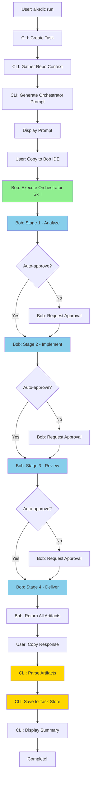

# AI SDLC Wrapper - Full Automation Plan

## 🎯 Objective

Transform the AI SDLC Wrapper from a manual copy-paste workflow into a fully automated system that executes the complete SDLC cycle with optional approval gates, using Bob's orchestrator skill approach.

## 🔄 Current vs. Proposed Architecture

### Current Architecture (Manual)
```
User → CLI (analyze) → Generate Prompt → User copies to Bob → Bob analyzes
     → User copies response → CLI parses → Save artifacts
     → CLI (generate) → Generate Prompt → User copies to Bob → Bob implements
     → CLI (review) → User runs /review in Bob → User copies response → CLI parses
     → CLI (pr) → Generate PR description
```

**Problems:**
- 4 separate copy-paste operations
- Manual context switching between CLI and Bob IDE
- Time-consuming and error-prone
- Breaks automation flow

### Proposed Architecture (Automated)
```
User → CLI (run) → Generate Orchestrator Prompt → User pastes to Bob once
     → Bob executes full SDLC using orchestrator skill
     → Bob returns all artifacts in structured format
     → User copies response once → CLI parses all artifacts → Complete
```

**Benefits:**
- Single copy-paste operation (or zero with API integration)
- Bob handles entire workflow internally
- Approval gates within Bob's execution
- All artifacts returned together
- Maintains full traceability

## 📋 Implementation Plan

### Phase 1: Create Bob Orchestrator Skill

**File:** `.bob/skills/sdlc-orchestrator.md`

Create a master skill that orchestrates all SDLC stages within Bob IDE.

**Key Features:**
- Executes analyze → implement → review → deliver in sequence
- Requests approval before each stage (if not auto-approved)
- Returns all artifacts in structured JSON format
- Handles errors and provides rollback guidance
- Integrates with existing sdlc-plan, sdlc-code, sdlc-review, sdlc-deliver skills

**Structure:**
```markdown
# SDLC Orchestrator Skill

## Purpose
Execute complete SDLC workflow for a feature from requirements to PR-ready code.

## Input Format
{
  "title": "Feature title",
  "description": "Feature description",
  "autoApprove": false,
  "repoContext": { ... }
}

## Execution Flow
1. ANALYZE: Use sdlc-plan skill
2. IMPLEMENT: Use sdlc-code skill  
3. REVIEW: Use sdlc-review skill
4. DELIVER: Use sdlc-deliver skill

## Output Format
{
  "status": "success|partial|failed",
  "completedStages": ["analyze", "implement", "review", "deliver"],
  "artifacts": {
    "requirements": { ... },
    "implementationPlan": { ... },
    "codeChanges": { ... },
    "reviewReport": { ... },
    "prDescription": { ... }
  },
  "approvals": {
    "analyze": true,
    "implement": true,
    "review": true,
    "deliver": true
  }
}
```

### Phase 2: Add Orchestrator Response Parser

**File:** `src/utils/orchestrator-parser.ts`

Parse Bob's orchestrator response and extract all artifacts.

**Key Functions:**
- `parseOrchestratorResponse(response: string): OrchestratorResult`
- `validateArtifacts(artifacts: any): boolean`
- `extractStageResults(response: string): StageResults`

**Features:**
- Robust JSON extraction from markdown
- Validation of all required artifacts
- Error handling for partial completions
- Support for incremental parsing

### Phase 3: Create New `run` Command

**File:** `src/cli/commands/run.ts`

Single command that executes the entire SDLC workflow.

**Command Signature:**
```bash
ai-sdlc run <title> [options]

Options:
  -d, --description <desc>    Feature description
  -a, --auto-approve          Skip approval gates
  -i, --interactive           Show progress and request confirmations
  --skip-stages <stages>      Skip specific stages (comma-separated)
```

**Workflow:**
1. Create task with unique ID
2. Gather repository context (cached if available)
3. Generate orchestrator prompt with all context
4. Display prompt for user to copy to Bob
5. Wait for user to paste Bob's complete response
6. Parse all artifacts from response
7. Save artifacts to task store
8. Update task status to 'complete'
9. Display summary and next steps

### Phase 4: Add Approval Manager System

**File:** `src/core/approval-manager.ts`

Manage approval gates and auto-approval configuration.

**Key Features:**
- Check if auto-approval is enabled
- Request user approval for each stage
- Track approval history
- Support for approval timeouts
- Configuration persistence

**Interface:**
```typescript
class ApprovalManager {
  async requestApproval(stage: string, context: any): Promise<boolean>
  isAutoApprovalEnabled(): boolean
  setAutoApproval(enabled: boolean): void
  getApprovalHistory(taskId: string): ApprovalHistory
}
```

### Phase 5: Update Type Definitions

**File:** `src/core/types.ts`

Add new types for orchestrator workflow.

**New Types:**
```typescript
// Orchestrator input
export const OrchestratorInputSchema = z.object({
  title: z.string(),
  description: z.string().optional(),
  autoApprove: z.boolean(),
  repoContext: RepoContextSchema,
  skipStages: z.array(z.string()).optional(),
});

// Orchestrator output
export const OrchestratorResultSchema = z.object({
  status: z.enum(['success', 'partial', 'failed']),
  completedStages: z.array(z.string()),
  artifacts: z.object({
    requirements: RequirementsSchema.optional(),
    implementationPlan: ImplementationPlanSchema.optional(),
    codeChanges: CodeChangesSchema.optional(),
    reviewReport: ReviewReportSchema.optional(),
    prDescription: PRDescriptionSchema.optional(),
  }),
  approvals: z.record(z.boolean()),
  errors: z.array(z.object({
    stage: z.string(),
    message: z.string(),
  })).optional(),
});

// Approval configuration
export const ApprovalConfigSchema = z.object({
  enabled: z.boolean(),
  timeout: z.number(),
  requireConfirmation: z.boolean(),
});
```

### Phase 6: Create Orchestrator Prompt Generator

**File:** `src/prompts/orchestrator-prompt.ts`

Generate the master prompt for Bob's orchestrator skill.

**Key Functions:**
```typescript
export function generateOrchestratorPrompt(
  task: Task,
  repoContext: RepoContext,
  options: OrchestratorOptions
): string
```

**Prompt Structure:**
```markdown
# Execute SDLC Workflow

Use the **sdlc-orchestrator** skill to complete this feature.

## Feature Details
- **Title**: {{title}}
- **Description**: {{description}}
- **Auto-approve**: {{autoApprove}}

## Repository Context
{{repoContext}}

## Instructions
1. Execute all SDLC stages in sequence
2. Request approval before each stage (unless auto-approved)
3. Return all artifacts in the specified JSON format
4. Handle errors gracefully and provide rollback guidance

## Expected Output
Return a JSON object with all artifacts and execution status.
```

### Phase 7: Update CLI Entry Point

**File:** `src/cli/index.ts`

Add the new `run` command to the CLI.

**Changes:**
```typescript
import { runCommand } from './commands/run';

program
  .command('run <title>')
  .description('Execute complete SDLC workflow (automated)')
  .option('-d, --description <desc>', 'Feature description')
  .option('-a, --auto-approve', 'Skip approval gates')
  .option('-i, --interactive', 'Interactive mode with progress')
  .option('--skip-stages <stages>', 'Skip stages (comma-separated)')
  .action(async (title: string, options) => {
    try {
      await runCommand(title, options);
    } catch (error) {
      console.error(chalk.red('Error:'), error.message);
      process.exit(1);
    }
  });
```

### Phase 8: Add Configuration for Auto-Approval

**File:** `.ai-sdlc/config.json`

Extend configuration to support automation settings.

**New Configuration:**
```json
{
  "version": "2.0.0",
  "projectType": "Node.js",
  "framework": "Express",
  "language": "TypeScript",
  "initializedAt": "2026-05-17T08:00:00.000Z",
  "automation": {
    "autoApprove": false,
    "approvalTimeout": 300,
    "retryOnFailure": true,
    "maxRetries": 3
  },
  "orchestrator": {
    "enabled": true,
    "defaultMode": "interactive",
    "skipStages": []
  }
}
```

### Phase 9: Update Documentation

**Files to Update:**
- `README.md` - Add new `run` command documentation
- `ENHANCEMENT_PLAN.md` - Document automation architecture
- `.bob/skills/sdlc-orchestrator.md` - Complete skill documentation

**New README Section:**
```markdown
## 🚀 Automated Workflow (Recommended)

### Single Command Execution

Execute the entire SDLC workflow with one command:

```bash
# Interactive mode (with approval gates)
ai-sdlc run "Add rate limiting to login endpoint"

# Fully automated (no approvals)
ai-sdlc run "Add rate limiting" --auto-approve

# With description
ai-sdlc run "Add rate limiting" -d "Prevent brute force attacks"
```

### How It Works

1. CLI generates a master prompt for Bob's orchestrator skill
2. Copy and paste the prompt into Bob IDE once
3. Bob executes all SDLC stages internally:
   - Analyze requirements
   - Implement code
   - Review changes
   - Generate PR description
4. Copy Bob's response back to CLI
5. CLI parses all artifacts and saves them
6. Task is complete and PR-ready!

### Benefits

- ✅ Single copy-paste operation (vs. 4 separate ones)
- ✅ Bob handles entire workflow internally
- ✅ Optional approval gates for oversight
- ✅ All artifacts returned together
- ✅ Full traceability maintained
```

### Phase 10: Test End-to-End Workflow

**Test Scenarios:**

1. **Full Automation Test**
   ```bash
   ai-sdlc run "Add health check endpoint" --auto-approve
   ```
   - Verify single prompt generation
   - Verify all artifacts are parsed correctly
   - Verify task status updates

2. **Interactive Mode Test**
   ```bash
   ai-sdlc run "Add rate limiting" --interactive
   ```
   - Verify approval prompts appear
   - Verify user can approve/reject stages
   - Verify partial completion handling

3. **Error Handling Test**
   - Test with invalid Bob response
   - Test with partial artifacts
   - Test with missing required fields

4. **Backward Compatibility Test**
   - Verify old commands still work
   - Verify existing tasks can be loaded
   - Verify migration path for old tasks

## 📊 Architecture Diagram



## 🔧 Implementation Order

1. ✅ **Phase 1**: Create orchestrator skill (foundation)
2. ✅ **Phase 5**: Update type definitions (required for other phases)
3. ✅ **Phase 2**: Add orchestrator parser (core functionality)
4. ✅ **Phase 6**: Create prompt generator (core functionality)
5. ✅ **Phase 4**: Add approval manager (supporting feature)
6. ✅ **Phase 3**: Create run command (main interface)
7. ✅ **Phase 7**: Update CLI entry point (integration)
8. ✅ **Phase 8**: Add configuration (settings)
9. ✅ **Phase 9**: Update documentation (user-facing)
10. ✅ **Phase 10**: Test end-to-end (validation)

## 🎯 Success Criteria

- [ ] Single `ai-sdlc run` command executes full SDLC
- [ ] Only 1 copy-paste operation required (vs. 4 previously)
- [ ] All artifacts are correctly parsed and saved
- [ ] Approval gates work correctly in interactive mode
- [ ] Auto-approve mode works without user intervention
- [ ] Backward compatibility maintained with old commands
- [ ] Error handling is robust and informative
- [ ] Documentation is clear and comprehensive

## 🚀 Future Enhancements

### API Integration (Phase 2)
- Direct Bob API integration (if available)
- Zero copy-paste workflow
- Real-time progress updates
- Automatic retry on failures

### GitHub Integration
- Automatic PR creation
- Auto-assign reviewers
- Auto-add labels based on changes
- Link to GitHub issues

### Advanced Features
- Multi-task orchestration
- Dependency management between tasks
- Parallel execution of independent tasks
- CI/CD integration

## 📝 Notes

- The orchestrator skill is the key innovation that enables full automation
- Bob handles all the complexity internally using its existing skills
- CLI becomes a thin orchestration layer
- All existing functionality is preserved for backward compatibility
- This approach maximizes Bob's capabilities while minimizing manual work