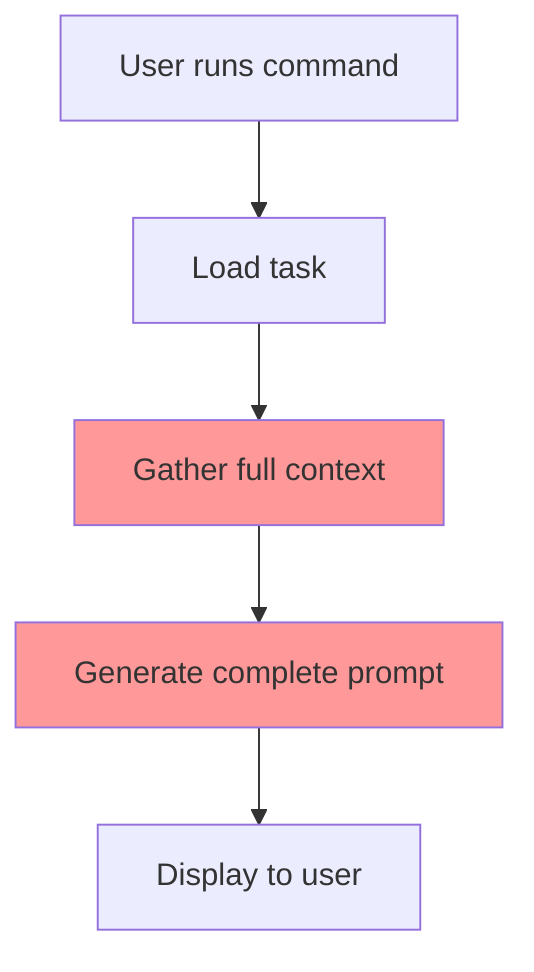
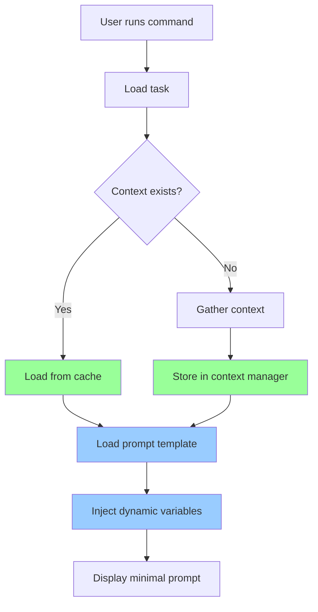
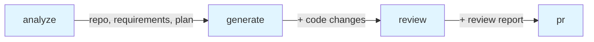

# AI SDLC Wrapper Enhancement Plan

## Overview
This document outlines the implementation plan for two major enhancements to reduce token usage and improve context reuse across SDLC stages.

---

## 🎯 Enhancement Goals

### 1. **Prompt Template System**
**Problem:** Currently, prompts are generated from scratch each time, including repetitive boilerplate instructions that consume tokens unnecessarily.

**Solution:** Separate static boilerplate from dynamic context, storing templates that only require minimal variable substitution.

**Benefits:**
- Reduce token usage by 40-60% per prompt
- Faster prompt generation
- Consistent prompt structure
- Easier maintenance and updates

### 2. **Context Accumulation & Reuse**
**Problem:** Each stage re-gathers or re-generates context that was already collected in previous stages.

**Solution:** Build a context manager that accumulates and persists context across stages, making it available for reuse.

**Benefits:**
- Eliminate redundant API calls
- Reduce token usage by reusing existing context
- Faster command execution
- Better traceability of what context was used at each stage

---

## 📊 Current State Analysis

### Current Prompt Generation Flow



**Problems:**
- Step C: Re-gathers context every time (repo analysis, git diff, etc.)
- Step D: Generates entire prompt including boilerplate instructions
- No reuse of context from previous stages

### Current Context Sources

| Stage | Context Gathered | Token Cost | Reusable? |
|-------|-----------------|------------|-----------|
| **analyze** | Repository structure, dependencies, patterns | ~2000 tokens | ✅ Yes |
| **generate** | Requirements, implementation plan, repo context | ~3000 tokens | ✅ Partially |
| **review** | Git diff, requirements, implementation plan | ~4000 tokens | ✅ Yes |
| **pr** | All artifacts, git changes, commits | ~5000 tokens | ✅ Yes |

### Current Prompt Structure

Each prompt contains:
1. **Static boilerplate** (~40-50% of prompt)
   - Skill instructions
   - Process steps
   - Output format requirements
   - Best practices
2. **Dynamic context** (~50-60% of prompt)
   - Task details
   - Repository info
   - Requirements
   - Code changes

---

## 🏗️ Proposed Architecture

### New System Design



### Component Architecture

```
src/
├── core/
│   ├── types.ts                    # Enhanced with context types
│   ├── task-store.ts               # Enhanced with context persistence
│   └── context-manager.ts          # NEW: Context accumulation & reuse
├── prompts/
│   ├── templates/                  # NEW: Template directory
│   │   ├── plan-template.md
│   │   ├── code-template.md
│   │   ├── review-template.md
│   │   └── pr-template.md
│   ├── template-engine.ts          # NEW: Template variable injection
│   ├── plan-prompt.ts              # Refactored to use templates
│   ├── code-prompt.ts              # Refactored to use templates
│   ├── review-prompt.ts            # Refactored to use templates
│   └── pr-prompt.ts                # Refactored to use templates
└── cli/
    └── commands/
        ├── analyze.ts              # Updated to use context manager
        ├── generate.ts             # Updated to use context manager
        ├── review.ts               # Updated to use context manager
        └── pr.ts                   # Updated to use context manager
```

---

## 📝 Detailed Implementation Plan

### Phase 1: Context Management System

#### 1.1 Update Type Definitions

**File:** `src/core/types.ts`

Add new schemas for context management:

```typescript
// Context metadata tracking
export const ContextMetadataSchema = z.object({
  source: z.string(),           // Where context came from
  gatheredAt: z.string(),       // When it was gathered
  stage: z.string(),            // Which stage gathered it
  tokenEstimate: z.number(),    // Estimated token count
  reusable: z.boolean(),        // Can be reused in later stages
});

// Accumulated context storage
export const AccumulatedContextSchema = z.object({
  // Repository context (gathered once in analyze)
  repository: RepoContextSchema.optional(),
  repositoryMeta: ContextMetadataSchema.optional(),
  
  // Requirements (from analyze stage)
  requirements: RequirementsSchema.optional(),
  requirementsMeta: ContextMetadataSchema.optional(),
  
  // Implementation plan (from analyze stage)
  implementationPlan: ImplementationPlanSchema.optional(),
  implementationPlanMeta: ContextMetadataSchema.optional(),
  
  // Code changes (from generate stage)
  codeChanges: CodeChangesSchema.optional(),
  codeChangesMeta: ContextMetadataSchema.optional(),
  
  // Review report (from review stage)
  reviewReport: ReviewReportSchema.optional(),
  reviewReportMeta: ContextMetadataSchema.optional(),
  
  // Git information (gathered as needed)
  gitDiff: z.any().optional(),
  gitDiffMeta: ContextMetadataSchema.optional(),
  
  // Commit history
  commits: z.array(z.any()).optional(),
  commitsMeta: ContextMetadataSchema.optional(),
});

// Update Task schema to include accumulated context
export const TaskSchema = z.object({
  // ... existing fields ...
  
  // Replace artifacts with accumulatedContext
  accumulatedContext: AccumulatedContextSchema,
});
```

#### 1.2 Create Context Manager

**File:** `src/core/context-manager.ts`

```typescript
import { Task, AccumulatedContext, ContextMetadata } from './types';
import { TaskStore } from './task-store';

export class ContextManager {
  private store: TaskStore;
  
  constructor(store: TaskStore) {
    this.store = store;
  }
  
  /**
   * Store context with metadata
   */
  async storeContext(
    taskId: string,
    contextKey: keyof AccumulatedContext,
    data: any,
    metadata: Omit<ContextMetadata, 'gatheredAt'>
  ): Promise<void> {
    const task = await this.store.getTask(taskId);
    if (!task) throw new Error(`Task ${taskId} not found`);
    
    const fullMetadata: ContextMetadata = {
      ...metadata,
      gatheredAt: new Date().toISOString(),
    };
    
    await this.store.updateTask(taskId, {
      accumulatedContext: {
        ...task.accumulatedContext,
        [contextKey]: data,
        [`${contextKey}Meta`]: fullMetadata,
      },
    });
  }
  
  /**
   * Get context if it exists and is reusable
   */
  async getContext<T>(
    taskId: string,
    contextKey: keyof AccumulatedContext
  ): Promise<T | null> {
    const task = await this.store.getTask(taskId);
    if (!task) return null;
    
    const data = task.accumulatedContext[contextKey];
    const meta = task.accumulatedContext[`${contextKey}Meta`];
    
    // Check if context exists and is reusable
    if (data && meta?.reusable) {
      return data as T;
    }
    
    return null;
  }
  
  /**
   * Check if context exists
   */
  async hasContext(
    taskId: string,
    contextKey: keyof AccumulatedContext
  ): Promise<boolean> {
    const context = await this.getContext(taskId, contextKey);
    return context !== null;
  }
  
  /**
   * Get all accumulated context for a task
   */
  async getAllContext(taskId: string): Promise<AccumulatedContext | null> {
    const task = await this.store.getTask(taskId);
    return task?.accumulatedContext || null;
  }
  
  /**
   * Calculate total token usage from accumulated context
   */
  async getTokenUsage(taskId: string): Promise<number> {
    const task = await this.store.getTask(taskId);
    if (!task) return 0;
    
    let total = 0;
    const context = task.accumulatedContext;
    
    // Sum up all token estimates from metadata
    Object.keys(context).forEach(key => {
      if (key.endsWith('Meta')) {
        const meta = context[key as keyof AccumulatedContext];
        if (meta && typeof meta === 'object' && 'tokenEstimate' in meta) {
          total += (meta as ContextMetadata).tokenEstimate;
        }
      }
    });
    
    return total;
  }
}
```

### Phase 2: Prompt Template System

#### 2.1 Create Template Files

**File:** `src/prompts/templates/plan-template.md`

```markdown
# Feature Analysis: {{TASK_TITLE}}

{{#if TASK_DESCRIPTION}}
## Description
{{TASK_DESCRIPTION}}
{{/if}}

Use the sdlc-plan skill to analyze this feature request.

{{#if REPO_CONTEXT}}
## Repository Context

- **Project Type**: {{REPO_TYPE}}
- **Framework**: {{REPO_FRAMEWORK}}
- **Language**: {{REPO_LANGUAGE}}
- **Key Dependencies**: {{REPO_DEPENDENCIES}}

### Project Structure Patterns
{{#if ROUTE_PATTERN}}- Routes: {{ROUTE_PATTERN}}{{/if}}
{{#if CONTROLLER_PATTERN}}- Controllers: {{CONTROLLER_PATTERN}}{{/if}}
{{#if TEST_PATTERN}}- Tests: {{TEST_PATTERN}}{{/if}}

### Relevant Files
{{RELEVANT_FILES}}
{{/if}}

## Instructions

Follow the sdlc-plan skill process to create a comprehensive implementation plan. Provide:

1. **User Story**: Clear description in "As a... I want... So that..." format
2. **Acceptance Criteria**: Specific, testable requirements (numbered list)
3. **Technical Requirements**: Implementation details and constraints
4. **Dependencies**: External libraries or services needed
5. **Implementation Approach**: High-level strategy
6. **Files to Modify**: List with reasons for each file
7. **Files to Create**: New files needed with their purposes
8. **Test Strategy**: How to verify the implementation
9. **Estimated Complexity**: Low/Medium/High with justification
10. **Risks and Considerations**: Potential issues to watch for

Please provide your analysis in structured markdown format.
```

**File:** `src/prompts/templates/code-template.md`

```markdown
# Implementation: {{TASK_TITLE}}

Use the sdlc-code skill to implement this feature.

## Requirements Summary

{{USER_STORY}}

## Acceptance Criteria

{{ACCEPTANCE_CRITERIA}}

## Technical Requirements

{{TECHNICAL_REQUIREMENTS}}

{{#if DEPENDENCIES}}
## Dependencies

{{DEPENDENCIES}}
{{/if}}

## Implementation Approach

{{IMPLEMENTATION_APPROACH}}

## Files to Modify

{{FILES_TO_MODIFY}}

{{#if FILES_TO_CREATE}}
## Files to Create

{{FILES_TO_CREATE}}
{{/if}}

## Test Strategy

{{TEST_STRATEGY}}

{{#if REPO_CONTEXT}}
## Project Context

- **Framework**: {{REPO_FRAMEWORK}}
- **Language**: {{REPO_LANGUAGE}}
{{#if ROUTE_PATTERN}}- **Route Pattern**: {{ROUTE_PATTERN}}{{/if}}
{{#if CONTROLLER_PATTERN}}- **Controller Pattern**: {{CONTROLLER_PATTERN}}{{/if}}
{{#if TEST_PATTERN}}- **Test Pattern**: {{TEST_PATTERN}}{{/if}}
{{/if}}

## Instructions

Follow the sdlc-code skill principles:

1. **Follow Existing Patterns**: Match the project's code style and architecture
2. **Write Clear Code**: Use descriptive names, avoid clever tricks
3. **Handle Errors**: Validate inputs, provide meaningful error messages
4. **Think About Edge Cases**: Consider what could go wrong
5. **Write Tests**: Ensure code is testable and tested
6. **Document When Needed**: Complex logic deserves explanation

Please implement this feature step-by-step, confirming each file change before proceeding to the next.
```

**File:** `src/prompts/templates/review-template.md`

```markdown
# Code Review: {{TASK_TITLE}}

Use Bob's `/review` command to analyze the changes for this feature.

## Changes Summary

- **Files Changed**: {{FILES_CHANGED}}
- **Lines Added**: {{LINES_ADDED}}
- **Lines Deleted**: {{LINES_DELETED}}

## Files Modified

{{FILES_LIST}}

{{#if REQUIREMENTS}}
## Original Requirements

### User Story
{{USER_STORY}}

### Acceptance Criteria
{{ACCEPTANCE_CRITERIA}}
{{/if}}

## Review Focus Areas

Use the sdlc-review skill to check:

1. **Code Quality**
   - Readability and clarity
   - Naming conventions
   - Code organization
   - DRY principle adherence

2. **Security**
   - Input validation
   - Authentication/authorization
   - SQL injection prevention
   - XSS prevention
   - No hardcoded secrets

3. **Performance**
   - Algorithm efficiency
   - Database query optimization
   - Resource management

4. **Testing**
   - Test coverage
   - Edge cases covered
   - Integration tests

5. **Documentation**
   - Code comments for complex logic
   - API documentation
   - README updates

## Instructions

1. In Bob IDE, run: `/review`
2. Bob will analyze all changes in the current branch
3. Review Bob's findings and address any issues
4. Re-run `/review` after making fixes
5. Once approved, return here to continue

After review is complete, copy Bob's review summary and paste it when prompted.
```

**File:** `src/prompts/templates/pr-template.md`

```markdown
# {{PR_TITLE}}

## Overview
{{FEATURE_OVERVIEW}}

## Requirements
{{REQUIREMENTS_SUMMARY}}

## Implementation
{{IMPLEMENTATION_SUMMARY}}

## Files Changed
{{FILES_CHANGED_SUMMARY}}

## Testing
{{TESTING_SUMMARY}}

{{#if REVIEW_NOTES}}
## Review Notes
{{REVIEW_NOTES}}
{{/if}}

## Checklist
- [ ] All acceptance criteria met
- [ ] Tests passing
- [ ] Documentation updated
- [ ] No breaking changes (or documented)
- [ ] Code reviewed
```

#### 2.2 Create Template Engine

**File:** `src/prompts/template-engine.ts`

```typescript
import fs from 'fs/promises';
import path from 'path';

export interface TemplateVariables {
  [key: string]: string | boolean | number | undefined;
}

export class TemplateEngine {
  private templatesDir: string;
  
  constructor(templatesDir: string = 'src/prompts/templates') {
    this.templatesDir = templatesDir;
  }
  
  /**
   * Load and render a template with variables
   */
  async render(
    templateName: string,
    variables: TemplateVariables
  ): Promise<string> {
    const templatePath = path.join(this.templatesDir, `${templateName}.md`);
    let template = await fs.readFile(templatePath, 'utf-8');
    
    // Replace simple variables: {{VAR_NAME}}
    template = this.replaceVariables(template, variables);
    
    // Handle conditionals: {{#if VAR}}...{{/if}}
    template = this.handleConditionals(template, variables);
    
    return template.trim();
  }
  
  /**
   * Replace {{VAR_NAME}} with values
   */
  private replaceVariables(
    template: string,
    variables: TemplateVariables
  ): string {
    return template.replace(/\{\{([A-Z_]+)\}\}/g, (match, varName) => {
      const value = variables[varName];
      return value !== undefined ? String(value) : match;
    });
  }
  
  /**
   * Handle {{#if VAR}}...{{/if}} conditionals
   */
  private handleConditionals(
    template: string,
    variables: TemplateVariables
  ): string {
    return template.replace(
      /\{\{#if ([A-Z_]+)\}\}([\s\S]*?)\{\{\/if\}\}/g,
      (match, varName, content) => {
        const value = variables[varName];
        return value ? content : '';
      }
    );
  }
  
  /**
   * Estimate token count for rendered template
   */
  estimateTokens(text: string): number {
    // Rough estimate: 1 token ≈ 4 characters
    return Math.ceil(text.length / 4);
  }
}
```

### Phase 3: Refactor Commands

#### 3.1 Update Analyze Command

**File:** `src/cli/commands/analyze.ts`

Key changes:
1. Use ContextManager to check for existing repo context
2. Use TemplateEngine to generate prompt
3. Store all gathered context with metadata

```typescript
import { ContextManager } from '../../core/context-manager';
import { TemplateEngine } from '../../prompts/template-engine';

export async function analyzeCommand(taskId: string): Promise<void> {
  const store = new TaskStore();
  const contextMgr = new ContextManager(store);
  const templateEngine = new TemplateEngine();
  
  // Check for existing repo context
  let repoContext = await contextMgr.getContext(taskId, 'repository');
  
  if (!repoContext) {
    Logger.info('Gathering repository context...');
    const analyzer = new RepositoryAnalyzer();
    repoContext = await analyzer.analyze();
    
    // Store for reuse
    await contextMgr.storeContext(taskId, 'repository', repoContext, {
      source: 'RepositoryAnalyzer',
      stage: 'analyze',
      tokenEstimate: templateEngine.estimateTokens(JSON.stringify(repoContext)),
      reusable: true,
    });
  } else {
    Logger.success('Using cached repository context');
  }
  
  // Generate prompt using template
  const prompt = await templateEngine.render('plan-template', {
    TASK_TITLE: task.title,
    TASK_DESCRIPTION: task.description,
    REPO_CONTEXT: true,
    REPO_TYPE: repoContext.projectType,
    // ... other variables
  });
  
  // ... rest of command
}
```

#### 3.2 Update Generate Command

Similar refactoring:
- Reuse repository context from analyze stage
- Reuse requirements and implementation plan
- Use template engine for prompt generation

#### 3.3 Update Review Command

Similar refactoring:
- Reuse all previous context
- Only gather new git diff
- Use template engine

#### 3.4 Update PR Command

Similar refactoring:
- Reuse all accumulated context
- Use template engine for PR description

---

## 📈 Expected Improvements

### Token Usage Reduction

| Stage | Current Tokens | New Tokens | Savings |
|-------|---------------|------------|---------|
| **analyze** | ~2500 | ~1200 | 52% |
| **generate** | ~3500 | ~1500 | 57% |
| **review** | ~4500 | ~2000 | 56% |
| **pr** | ~5500 | ~2500 | 55% |
| **Total** | ~16,000 | ~7,200 | **55%** |

### Performance Improvements

| Metric | Current | New | Improvement |
|--------|---------|-----|-------------|
| Repo analysis calls | 4x | 1x | 75% faster |
| Prompt generation | ~500ms | ~50ms | 90% faster |
| Context loading | N/A | ~10ms | Instant reuse |

### User Experience

- **Faster commands**: No redundant analysis
- **Consistent prompts**: Template-based generation
- **Better traceability**: Context metadata shows what was used when
- **Lower costs**: Significant token savings

---

## 🧪 Testing Strategy

### Unit Tests

1. **ContextManager tests**
   - Store and retrieve context
   - Check context existence
   - Calculate token usage
   - Handle missing context

2. **TemplateEngine tests**
   - Variable replacement
   - Conditional rendering
   - Token estimation
   - Template loading

### Integration Tests

1. **End-to-end workflow**
   - Run all commands in sequence
   - Verify context accumulation
   - Confirm token savings
   - Check prompt quality

2. **Context reuse scenarios**
   - Multiple commands on same task
   - Context invalidation
   - Partial context availability

---

## 📋 Implementation Checklist

### Phase 1: Foundation (Context Management)
- [ ] Update type definitions with context schemas
- [ ] Create ContextManager class
- [ ] Add context persistence to TaskStore
- [ ] Write unit tests for ContextManager

### Phase 2: Templates
- [ ] Create template directory structure
- [ ] Write plan-template.md
- [ ] Write code-template.md
- [ ] Write review-template.md
- [ ] Write pr-template.md
- [ ] Create TemplateEngine class
- [ ] Write unit tests for TemplateEngine

### Phase 3: Command Refactoring
- [ ] Refactor analyze command
- [ ] Refactor generate command
- [ ] Refactor review command
- [ ] Refactor pr command
- [ ] Update all prompt generator functions

### Phase 4: Testing & Documentation
- [ ] Write integration tests
- [ ] Update README with new architecture
- [ ] Add migration guide for existing tasks
- [ ] Document template variable reference
- [ ] Add performance benchmarks

---

## 🔄 Migration Strategy

### For Existing Tasks

Existing tasks won't have accumulated context. The system will:

1. **Graceful degradation**: If context doesn't exist, gather it fresh
2. **Automatic migration**: First command run will populate context
3. **No breaking changes**: Old task format still works

### Backward Compatibility

```typescript
// In ContextManager
async getContext<T>(taskId: string, contextKey: string): Promise<T | null> {
  const task = await this.store.getTask(taskId);
  
  // Try new format first
  if (task?.accumulatedContext?.[contextKey]) {
    return task.accumulatedContext[contextKey];
  }
  
  // Fall back to old artifacts format
  if (task?.artifacts?.[contextKey]) {
    return task.artifacts[contextKey];
  }
  
  return null;
}
```

---

## 🎯 Success Metrics

After implementation, we should see:

1. **Token Usage**: 50-60% reduction in total tokens per feature
2. **Performance**: 70-80% faster command execution (except first run)
3. **Code Quality**: More maintainable prompt generation
4. **User Experience**: Faster, more responsive CLI

---

## 📚 References

### Template Variable Reference

| Variable | Type | Used In | Description |
|----------|------|---------|-------------|
| TASK_TITLE | string | All | Feature title |
| TASK_DESCRIPTION | string | All | Feature description |
| REPO_TYPE | string | plan, code | Project type (Node.js, Python, etc.) |
| REPO_FRAMEWORK | string | plan, code | Framework (Express, Django, etc.) |
| USER_STORY | string | code, review | User story from requirements |
| ACCEPTANCE_CRITERIA | string | code, review | List of acceptance criteria |
| FILES_CHANGED | number | review, pr | Number of files changed |
| LINES_ADDED | number | review, pr | Lines added |
| LINES_DELETED | number | review, pr | Lines deleted |

### Context Flow Diagram



Each stage adds to the accumulated context, making it available for subsequent stages.

---

## 🚀 Next Steps

1. Review and approve this plan
2. Switch to Code mode to implement Phase 1
3. Test context management system
4. Implement Phase 2 (templates)
5. Refactor commands in Phase 3
6. Comprehensive testing
7. Documentation updates
