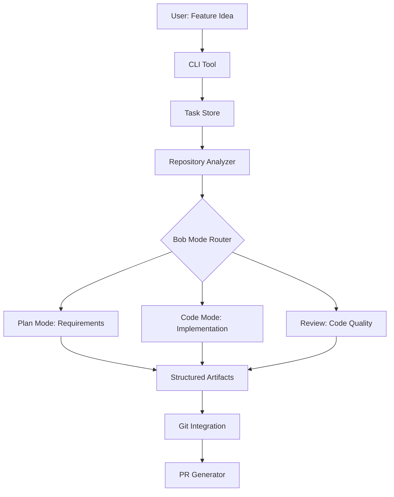

# AI SDLC Wrapper - Implementation Plan

## Project Overview

**Goal**: Build a TypeScript CLI tool that transforms feature ideas into structured SDLC artifacts using IBM Bob IDE as the core AI engine.

**Core Concept**: Bob orchestrates the entire SDLC workflow through its specialized modes (Plan, Code, Review) and custom Skills.

---

## Architecture



---

## Project Structure

```
ai-sdlc-wrapper/
├── src/
│   ├── cli/
│   │   ├── index.ts              # CLI entry point
│   │   └── commands/             # Command implementations
│   ├── core/
│   │   ├── task-store.ts         # Task persistence
│   │   └── types.ts              # Type definitions
│   ├── repo/
│   │   └── analyzer.ts           # Codebase analysis
│   ├── git/
│   │   └── operations.ts         # Git commands
│   ├── prompts/
│   │   ├── plan-prompt.ts        # Plan mode prompts
│   │   ├── code-prompt.ts        # Code mode prompts
│   │   └── review-prompt.ts      # Review prompts
│   └── utils/
├── .bob/skills/                  # Bob Skills
├── .ai-sdlc/tasks/              # Task artifacts
├── tests/
└── package.json
```

---

## Implementation Phases

### Phase 1: Core Infrastructure (2-3 Bobcoins)

**Setup TypeScript project with:**
- Commander.js for CLI
- Zod for validation
- Simple-git for Git operations
- Jest for testing

**Task Store Implementation:**
```typescript
interface Task {
  id: string;                    // FEATURE-001
  title: string;
  status: 'draft' | 'analyzing' | 'ready' | 'implementing' | 'reviewing' | 'complete';
  artifacts: {
    requirements?: Requirements;
    repoContext?: RepoContext;
    implementationPlan?: ImplementationPlan;
    codeChanges?: CodeChanges;
    reviewReport?: ReviewReport;
    prDescription?: PRDescription;
  };
}
```

**Bobcoin Usage**: Use Bob Code mode to scaffold project structure and implement task store.

---

### Phase 2: Repository Analyzer (2-3 Bobcoins)

**Analyze codebase to extract:**
- Project type (Node.js, Python, Java)
- Framework (Express, React, Django)
- Dependencies
- File structure
- Code patterns
- Relevant files for feature

**Key Function:**
```typescript
async analyze(): Promise<RepoContext> {
  const projectType = await this.detectProjectType();
  const dependencies = await this.parseDependencies();
  const fileTree = await this.buildFileTree();
  const patterns = await this.detectPatterns();
  return { projectType, dependencies, fileTree, patterns };
}
```

**Bobcoin Usage**: Use Bob Code mode to implement analyzer with pattern detection.

---

### Phase 3: CLI Commands (3-4 Bobcoins)

**Command: `ai-sdlc init`**
- Create `.ai-sdlc/` directory structure
- Analyze repository
- Save configuration
- Prompt user to run Bob `/init`

**Command: `ai-sdlc new <title>`**
- Generate unique task ID (FEATURE-001)
- Create task with 'draft' status
- Save to `.ai-sdlc/tasks/{id}.json`

**Command: `ai-sdlc analyze <taskId>`**
- Load task
- Get repository context
- Generate Bob Plan mode prompt
- Display prompt for user to copy
- Accept Bob's response
- Parse and save requirements
- Update status to 'ready'

**Command: `ai-sdlc generate <taskId>`**
- Load task with requirements
- Create feature branch
- Generate Bob Code mode prompt
- Display prompt for implementation

**Command: `ai-sdlc review <taskId>`**
- Get git diff
- Generate review instructions
- Guide user to use Bob `/review`
- Save review results

**Command: `ai-sdlc pr <taskId>`**
- Analyze git changes
- Generate PR description from artifacts
- Display formatted PR description

**Bobcoin Usage**: Use Bob Code mode to implement each command incrementally.

---

### Phase 4: Bob Skills (4-5 Bobcoins)

**Create 4 Skills in `.bob/skills/`:**

**1. sdlc-plan.md** - Requirements Analysis
- Guide Bob through feature analysis
- Extract user story, acceptance criteria
- Identify technical requirements
- Create implementation plan
- Estimate complexity

**2. sdlc-code.md** - Implementation
- Follow project patterns
- Write production-quality code
- Handle errors gracefully
- Include tests
- Update documentation

**3. sdlc-review.md** - Code Review
- Check code quality
- Verify security
- Assess performance
- Validate tests
- Review documentation

**4. sdlc-deliver.md** - PR Preparation
- Verify completeness
- Generate PR description
- Final checks
- Prepare artifacts

**Bobcoin Usage**: Use Bob Advanced mode with Skills to create and test each skill.

---

### Phase 5: Prompt Generators (2-3 Bobcoins)

**Plan Prompt Template:**
```typescript
function generatePlanPrompt(task: Task, context: RepoContext): string {
  return `
# Feature Analysis: ${task.title}

Use the sdlc-plan skill to analyze this feature.

## Repository Context
- Project: ${context.projectType}
- Framework: ${context.framework}
- Language: ${context.language}

## Instructions
Follow the sdlc-plan skill process to create a comprehensive plan.
  `;
}
```

**Code Prompt Template:**
```typescript
function generateCodePrompt(task: Task): string {
  return `
# Implementation: ${task.title}

Use the sdlc-code skill to implement this feature.

## Requirements
${task.artifacts.requirements.userStory}

## Acceptance Criteria
${task.artifacts.requirements.acceptanceCriteria.join('\n')}

## Implementation Plan
${task.artifacts.implementationPlan.approach}

## Files to Modify
${task.artifacts.implementationPlan.filesToModify.map(f => `- ${f.path}: ${f.reason}`).join('\n')}

Follow the sdlc-code skill principles.
  `;
}
```

**Bobcoin Usage**: Use Bob Code mode to implement prompt generators with proper formatting.

---

### Phase 6: Git Integration (2-3 Bobcoins)

**Git Operations:**
```typescript
class GitService {
  async createFeatureBranch(taskId: string): Promise<string>;
  async getDiff(base: string, head: string): Promise<GitDiff>;
  async getChangedFiles(): Promise<string[]>;
  async getCommitHistory(): Promise<Commit[]>;
}
```

**Diff Analysis:**
- Track files modified/added/deleted
- Count lines changed
- Extract commit messages
- Generate change summary

**Bobcoin Usage**: Use Bob Code mode to implement git operations with simple-git library.

---

### Phase 7: Testing (3-4 Bobcoins)

**Unit Tests:**
- Task store operations
- Repository analyzer
- Prompt generators
- Git operations

**Integration Tests:**
- CLI command execution
- End-to-end workflow
- Bob prompt generation

**Test Example:**
```typescript
describe('TaskStore', () => {
  test('creates task with unique ID', async () => {
    const task = await store.createTask('Test feature');
    expect(task.id).toMatch(/^FEATURE-\d+$/);
    expect(task.status).toBe('draft');
  });
});
```

**Bobcoin Usage**: Use Bob Code mode to write comprehensive tests, then Bob Review to verify coverage.

---

### Phase 8: Documentation (2-3 Bobcoins)

**README.md:**
- Project overview
- Installation instructions
- Command reference
- Workflow examples
- Bob integration guide

**AGENTS.md** (Generated by Bob `/init`):
- Project context
- Architecture overview
- Development workflow

**Bobcoin Usage**: Use Bob Plan mode to structure documentation, then Code mode to write content.

---

## Bobcoin Budget Allocation (Total: 25-30 Bobcoins)

| Phase | Task | Bobcoins | Strategy |
|-------|------|----------|----------|
| 1 | Project setup & task store | 2-3 | Use Code mode for scaffolding |
| 2 | Repository analyzer | 2-3 | Use Code mode with focused prompts |
| 3 | CLI commands (6 commands) | 3-4 | Implement incrementally, one at a time |
| 4 | Bob Skills (4 skills) | 4-5 | Use Advanced mode, test each skill |
| 5 | Prompt generators | 2-3 | Use Code mode with templates |
| 6 | Git integration | 2-3 | Use Code mode with simple-git |
| 7 | Testing | 3-4 | Use Code mode for tests, Review for validation |
| 8 | Documentation | 2-3 | Use Plan mode for structure, Code for content |
| **Total** | | **25-30** | |

---

## Bobcoin Optimization Strategies

### 1. Use Skills to Reduce Prompt Size
- Create reusable Skills for common tasks
- Reference Skills instead of repeating instructions
- Skills act as "recipes" that Bob follows

### 2. Leverage AGENTS.md for Context
- Run `/init` early to generate AGENTS.md
- Bob will use this for persistent context
- Reduces need to repeat project information

### 3. Break Tasks into Small Chunks
- Implement one command at a time
- Test incrementally
- Avoid large, complex prompts

### 4. Use Specific File Mentions
- Use `@filename` to reference specific files
- Avoids loading entire codebase into context
- More efficient than broad context

### 5. Iterate on Small Changes
- Make targeted modifications
- Use `apply_diff` for surgical edits
- Avoid full file rewrites

---

## Implementation Workflow

### Step 1: Initialize Project (Bob Code Mode)
```
Prompt: "Create a TypeScript CLI project with Commander.js, Zod, and Jest. 
Set up the directory structure as specified in the plan."
```

### Step 2: Implement Task Store (Bob Code Mode)
```
Prompt: "Implement the TaskStore class with methods to create, read, update, 
and list tasks. Use Zod for validation."
```

### Step 3: Build Repository Analyzer (Bob Code Mode)
```
Prompt: "Implement RepositoryAnalyzer to detect project type, parse dependencies, 
and build file tree. Support Node.js and Python projects."
```

### Step 4: Create CLI Commands (Bob Code Mode - Incremental)
```
Prompt 1: "Implement init command to initialize .ai-sdlc directory"
Prompt 2: "Implement new command to create tasks"
Prompt 3: "Implement analyze command with Bob Plan mode integration"
... (continue for each command)
```

### Step 5: Create Bob Skills (Bob Advanced Mode)
```
Prompt: "Create sdlc-plan.md skill that guides requirements analysis. 
Include process steps and output format."
... (repeat for each skill)
```

### Step 6: Implement Prompt Generators (Bob Code Mode)
```
Prompt: "Create prompt generator functions that format task data for Bob modes. 
Include templates for Plan, Code, and Review modes."
```

### Step 7: Add Git Integration (Bob Code Mode)
```
Prompt: "Implement GitService using simple-git to create branches, 
get diffs, and track changes."
```

### Step 8: Write Tests (Bob Code Mode + Review)
```
Prompt: "Write Jest tests for TaskStore, RepositoryAnalyzer, and CLI commands. 
Aim for >80% coverage."

Then use Bob /review to verify test quality.
```

### Step 9: Create Documentation (Bob Plan + Code Mode)
```
Plan Mode: "Create outline for README with installation, usage, and examples"
Code Mode: "Write comprehensive README based on the outline"
```

---

## Success Criteria

### Technical Requirements
✅ TypeScript CLI with all 6 commands working
✅ Task storage persisting artifacts
✅ Repository analyzer extracting context
✅ 4 Bob Skills created and functional
✅ Git integration tracking changes
✅ PR description generation
✅ Test coverage >80%

### Bob Integration
✅ Bob used as primary development tool
✅ `/init` run and AGENTS.md generated
✅ Plan mode for requirements
✅ Code mode for implementation
✅ Advanced mode for Skills
✅ `/review` for code review

### Deliverables
✅ Working CLI tool
✅ Comprehensive README
✅ 4 Bob Skills in `.bob/skills/`
✅ Test suite with good coverage
✅ Clean, documented code

---

## Risk Mitigation

### Risk: Bobcoin Budget Exceeded
**Mitigation:**
- Use Skills to reduce prompt size
- Break tasks into smaller chunks
- Leverage AGENTS.md for context
- Monitor usage after each task

### Risk: Bob Skills Not Working as Expected
**Mitigation:**
- Test Skills incrementally
- Start with simple examples
- Iterate based on Bob's responses
- Have fallback to manual prompts

### Risk: Repository Analyzer Inaccurate
**Mitigation:**
- Test on multiple project types
- Allow manual context override
- Provide clear error messages
- Include validation checks

### Risk: Time Constraints
**Mitigation:**
- Follow strict phase order
- Prioritize core features
- Have MVP scope defined
- Cut optional features if needed

---

## Example Usage Flow

### 1. Initialize Project
```bash
cd my-express-app
ai-sdlc init
# Opens Bob IDE, runs /init
```

### 2. Create Feature Task
```bash
ai-sdlc new "Add rate limiting to login endpoint"
# Output: Created task FEATURE-001
```

### 3. Analyze Requirements
```bash
ai-sdlc analyze FEATURE-001
# Displays Bob Plan mode prompt
# User copies to Bob IDE
# Bob analyzes and returns requirements
# User pastes Bob's response
# Requirements saved
```

### 4. Generate Implementation Prompt
```bash
ai-sdlc generate FEATURE-001
# Creates feature branch
# Displays Bob Code mode prompt
# User copies to Bob IDE
# Bob implements the feature
```

### 5. Review Code
```bash
ai-sdlc review FEATURE-001
# Displays review instructions
# User runs /review in Bob IDE
# Review results saved
```

### 6. Generate PR
```bash
ai-sdlc pr FEATURE-001
# Analyzes git changes
# Generates PR description
# Displays formatted PR
```

---

## Conclusion

This implementation plan provides a focused, efficient approach to building the AI SDLC wrapper with careful Bobcoin management. By:

1. **Using Bob as the Core Engine**: Bob drives all intelligence through its modes and skills
2. **Optimizing Bobcoin Usage**: Strategic use of Skills, AGENTS.md, and incremental development
3. **Building Incrementally**: Small, focused tasks that can be completed efficiently
4. **Testing Thoroughly**: Ensuring quality while staying within budget
5. **Documenting Well**: Making the tool accessible and maintainable

The project will deliver a practical tool that showcases Bob's capabilities across the full SDLC while staying well within the Bobcoin budget.